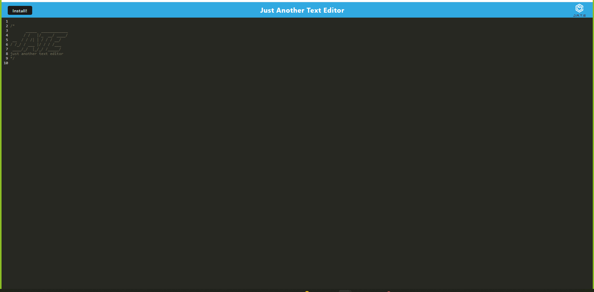

# Amazing Text 

## Description

This application is a text editor that runs in a browser. It works as a single page Progressive Web Application that can be installed. It saves the text as you write. 

[Heroku Deployed Application](https://amazingtext.herokuapp.com/)

## Table of Contents

- [Description](#description)
- [Installation](#installation-instructions)
- [Usage](#usage-information)
- [License](#license-information)
- [Contribution](#contribution-guidelines)
- [Test Instructions](#test-instructions)
- [Questions](#questions)

## Installation Instructions

Press the install button and follow the prompts.

## Usage Information

This project was used as an school assignment for learning PWA. 

## License Information

none

## Contribution Guidelines

Contributions are not being accepted at this time.

## Test Instructions

There is not any testing functionality for this application.

## Questions 

Please contact the email below with questions

github username: 14kappaman

email: aubrey.crook@gmail.com